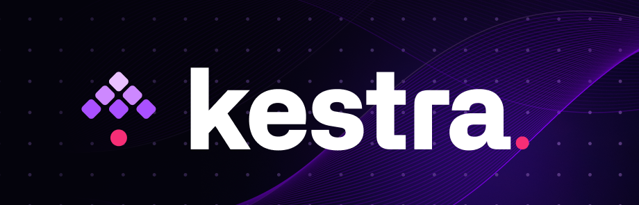

  

<h1 align="center">
Workflow Orchestration
<h1>

## 📌 Overview

This repository provides detailed guides and resources for workflow orchestration using **[Kestra](https://kestra.io/)**, focusing on automating ETL pipelines, scheduling tasks, and integrating with PostgreSQL & Google Cloud Platform (GCP).

It covers Kestra's **event-driven automation**, **YAML-based configurations**, and **best practices** for efficient workflow execution.

## 🛠️ Getting Started

### 🏁 To begin

1. Ensure you have Docker installed: [Get Docker here](https://www.docker.com/)
2. Configure **PostgreSQL** or **GCP** (as per the workflows used)
3. It is advisable to use cloud services due to the handling of large datasets.

> [!IMPORTANT]
>
> - Check the [Summary](#summary), and click on the desired topic for a detailed note.
> - There's a [Navigation Menu](#navigation-menu) on the bottom for easy navigation.

## 📖 Summary

### 1. [Workflow Orchestration Introduction](./public_notes/2-2-1-notes.md)

#### 🎯 1.1. Key Topics
- Understanding **Workflow Orchestration**
- What is **Kestra** and why use it?
- Core concepts: **Tasks, Flows, and Executions**
- Deploying workflows on **Google Cloud**
- Using **parameters & scheduling**
- Monitoring & logging execution states

#### ⚡ 1.2. Highlights
- **Simplifies orchestration** by automating workflow execution.
- **Enhances visibility** with built-in monitoring and logging.
- **Cloud-ready** for scalable deployment.

---

### 2. [Getting Started with Kestra](./public_notes/2-2-2-notes.md)

#### 🎯 2.1. Key Topics
- **Kestra setup with Docker**
- YAML-based workflow definitions
- **Triggers and automation**
- Sending notifications via **Discord Webhook**
- Real-time **monitoring & execution logs**

#### ⚡ 2.2. Highlights
- **Quick setup** with Docker for seamless orchestration.
- **Event-driven automation** with flexible triggers.
- **Built-in logging** for efficient debugging and monitoring.

---

### 3. [ETL Pipeline with PostgreSQL and Kestra](./public_notes/2-2-3-notes.md)

#### 🎯 3.1. Key Topics
- **Extract, Transform, Load (ETL) Pipelines**
- **Kestra + PostgreSQL** integration
- Automating **data extraction & ingestion**
- Using **dynamic inputs** for flexible workflows

#### ⚡ 3.2. Highlights
- **Streamlines ETL workflows** with automated orchestration.
- **Optimized for PostgreSQL** with structured integration.
- **Handles large datasets** efficiently with dynamic inputs.

---

### 4️. [Managing Scheduling and Backfills with PostgreSQL](./public_notes/2-2-4-notes.md)

#### 🎯 4.1. Key Topics
- **Cron-based scheduling** for periodic workflows
- Implementing **backfills** for historical data processing
- **Optimizing scheduling efficiency**

#### ⚡ 4.2. Highlights
- **Ensures timely execution** with cron-based automation.
- **Supports historical data recovery** via backfilling.
- **Enhances data integrity** with structured scheduling.

---

### 5️. [Orchestrating dbt Models with Kestra](./public_notes/2-2-5-notes.md)

#### 🎯 5.1. Key Topics
- **dbt (Data Build Tool) + Kestra** integration
- **Automating SQL-based data transformations**
- Syncing dbt models from **GitHub**
- Managing structured data in **PostgreSQL**

#### ⚡ 5.2. Highlights
- **Automates data modeling** with dbt + Kestra.
- **Seamlessly integrates with GitHub** for version control.
- **Enhances transformation reliability** with structured execution.

---

### 6️. [ETL Pipelines with Kestra on Google Cloud](./public_notes/2-2-6-notes.md)

#### 🎯 6.1. Key Topics
- **Extracting data & storing it in GCS**
- **Loading data into BigQuery**
- Automating workflows using **Kestra triggers**
- **Cloud-based orchestration for scalable ETL**

#### ⚡ 6.2. Highlights
- **Leverages cloud storage** for seamless data management.
- **Automates BigQuery processing** with predefined workflows.
- **Optimized for scalability** in cloud-based ETL processes.

---

### 7️. [GCP Taxi Data Ingestion Pipeline](./public_notes/2-2-7-notes.md)

#### 🎯 7.1. Key Topics
- **Automating NYC Taxi Data ingestion**
- **Scheduling workflows with Cron expressions**
- Managing **backfill runs** to ensure data completeness
- Running **BigQuery analytics on ingested datasets**
s
#### ⚡ 7.2. Highlights
- **Ensures timely data ingestion** with scheduled triggers.
- **Supports backfill runs** for missing data correction.
- **Enables advanced analytics** via BigQuery integration.

---

## Navigation Menu

| **Notes**                                                        | **Description**                                                     |
|------------------------------------------------------------------|---------------------------------------------------------------------|
| [1. Workflow Orchestration Intro](./public_notes/2-2-1-notes.md) | Learn the basics of Kestra & orchestration.                         |
| [2. Getting Started with Kestra](./public_notes/2-2-2-notes.md)  | Setting up Kestra and first workflows.                              |
| [3. ETL Pipeline with PostgreSQL](./public_notes/2-2-3-notes.md) | Automating ETL pipelines workflows.                                 |
| [4. Scheduling & Backfills](./public_notes/2-2-4-notes.md)       | Managing time-based triggers & backfills in workflows.              |
| [5. dbt Models with Kestra](./public_notes/2-2-5-notes.md)       | Workflow using **dbt** to transform data.                           |
| [6. ETL Pipelines on GCP](./public_notes/2-2-6-notes.md)         | Extracting & processing data in Google Cloud.                       |
| [7. GCP Taxi Data Ingestion](./public_notes/2-2-7-notes.md)      | Scheduling Data ingestion into Google Cloud.                        |

---

[Back to the top](#banner)
