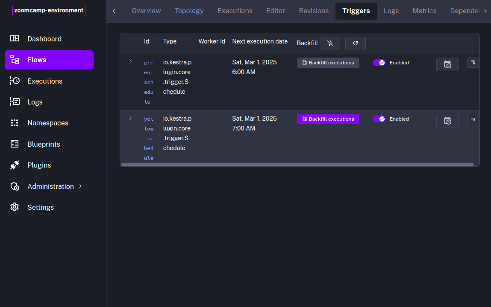
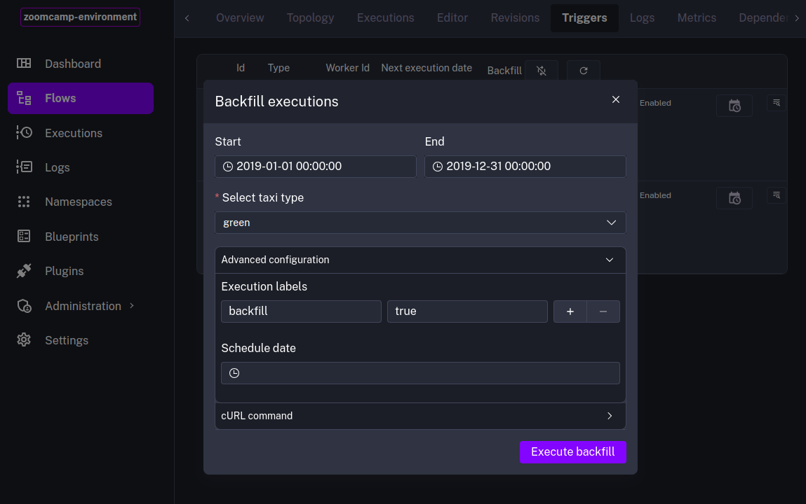

# Managing Scheduling and Backfills with PostgreSQL in Kestra

## 📌 Summary

This section explores how to efficiently manage **Cron schedules** and **backfills** using PostgreSQL in [Kestra](https://kestra.io/).

- Schedule workflows using **Cron expressions**
- Implement **backfilling** to handle historical data
- Optimize scheduling for **efficiency and reliability**

## 📁 Files used in this notebook
- Kestra flow **[2-2-4-flow.yml](#)**
<!-- TODO - add flow 2-2-4-flow.yml-->


## ⏳ Time-Based Scheduling (Cron Schedules) in Kestra

Kestra supports **Cron-based scheduling**, allowing workflows to run at specific times or intervals. This is useful for:

- **Periodic data processing** (e.g., daily ETL jobs)
- **Automated reports** (e.g., weekly/monthly reports)
- **Scheduled database maintenance** (e.g., nightly optimizations)

### Defining a Cron-Based Schedule in Kestra

- In Kestra, you can define **time-based triggers** using **Cron expressions**. Here's an example workflow that runs **every day at midnight** (green) and **every day at 1 AM** (yellow):

    ```yaml
    triggers:
    - id: green_schedule
        type: io.kestra.plugin.core.trigger.Schedule
        cron: "0 0 * * *"
        inputs:
        taxi: green

    - id: yellow_schedule
        type: io.kestra.plugin.core.trigger.Schedule
        cron: "0 1 * * *"
        inputs:
        taxi: yellow
    ```

- In the **concurrency** section, you can limit the number of concurrent executions to 1. This ensures that only one workflow is running at a time in order to avoid data being purged before it is processed.

    ```yml
    concurrency:
        limit: 1
    ```


### Minor Help - Understanding Cron Expressions

A **Cron expression** consists of **five fields**:
`minute hour day month day-of-week`

| Field         | Allowed Values  | Example |
|--------------|----------------|---------|
| **Minute**    | 0-59           | `0` (on the hour) |
| **Hour**      | 0-23           | `2` (2 AM) |
| **Day**       | 1-31           | `15` (15th day) |
| **Month**     | 1-12 or JAN-DEC | `*` (any month) |
| **Day of Week** | 0-6 or SUN-SAT | `MON` (Monday) |

Example Cron Patterns:

- `0 0 * * *` → Runs **every day at midnight**
- `0 9 * * 1` → Runs **every Monday at 9 AM**
- `0 */6 * * *` → Runs **every 6 hours**

> [!TIP]
>
>Use **[Crontab Guru](https://crontab.guru/)** to test your Cron expressions!

## 🔄 Handling Backfills

### What is a Backfill?

A **backfill** is a process that re-runs workflows for missing or past time intervals to ensure data completeness.

> [!IMPORTANT]
>
> We dont need the **year** and **month** inputs anymore.
>
> Also, adjust the variables accordingly.


### How to Implement Backfills in Kestra

**1.** Navigate to the **Triggers** page in Kestra UI.

**2.** Click the **Backfill executions** button.



**3.** Select the workflow and the dates you want to backfill
**4.** Select the taxi type (in our example, `green`)
**5.** In advanced settings, is recommended to add a label `backfill:true`



**6.** Click the **Execute Backfill** button or schedule the backfill.

---

| [HOME](../README.md) | [<< BACK](./2-2-3-notes.md) | [NEXT >>](./2-2-5-notes.md) |
| -------------------- | ----------------------- | --------------------------- |
