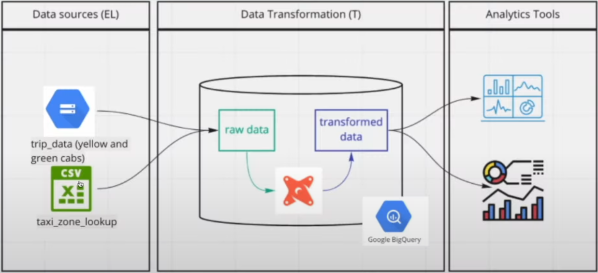

# Orchestrating dbt Models with Postgres in Kestra (Sneak Peek - OPTIONAL)

## 📌 Summary
This section is a sneak peek into how to use **dbt (Data Build Tool)** with **Kestra** to automate data transformations.

## 📁 Files used in this notebook
- Kestra flow **[2-2-5-flow.yml](#)**
<!-- TODO - add flow 2-2-5-flow.yml-->

## 🌍 Overview
### What is dbt?
**dbt (Data Build Tool)** is an open-source tool that allows data analysts and engineers to transform raw data in their warehouse using **SQL-based models**. 

> [!NOTE]
>
> This tool is going to be covered in more details in the following modules, so enjoy the brief integration with Kestra.

### How Does This Workflow Work?
The workflow pulls data, runs dbt transformations on a **PostgreSQL database**, and produces structured and cleaned data.



## 🛠️ Setup
### Configure PostgreSQL Connection
Ensure that the database connection is correctly set up in the **dbt profile**:

```yaml
outputs:
  dev:
    type: postgres
    host: host.docker.internal # or <your-postgres-container-name>
    user: kestra
    password: k3str4
    port: 5432
    dbname: postgres-zoomcamp
    schema: public
    threads: 8
    connect_timeout: 10
    priority: interactive
target: dev
```


### 🔄 Sync dbt Files
The **Sync task** to pull the latest dbt files form GitHub:

```yaml
- id: sync
  type: io.kestra.plugin.git.SyncNamespaceFiles
  url: https://github.com/DataTalksClub/data-engineering-zoomcamp
  branch: main
  namespace: "{{ flow.namespace }}"
  gitDirectory: 04-analytics-engineering/taxi_rides_ny
  dryRun: false
```

### 🚀 Execute dbt Commands
The **dbt CLI task** to build and transform the data:

```yaml
- id: dbt-build
  type: io.kestra.plugin.dbt.cli.DbtCLI
  commands:
    - dbt deps
    - dbt build
```

## 📊 Expected Output
**Raw CSV data** transformed into structured **PostgreSQL tables**.
**New tables** with aggregated and cleaned data.
**Improved readability** of datasets for analysis and visualization.


## 📝 Additional Notes
- Modify the `schema.yml` file to align with your database schema.
- Use `dbt debug` before `dbt build` to validate the connection.


