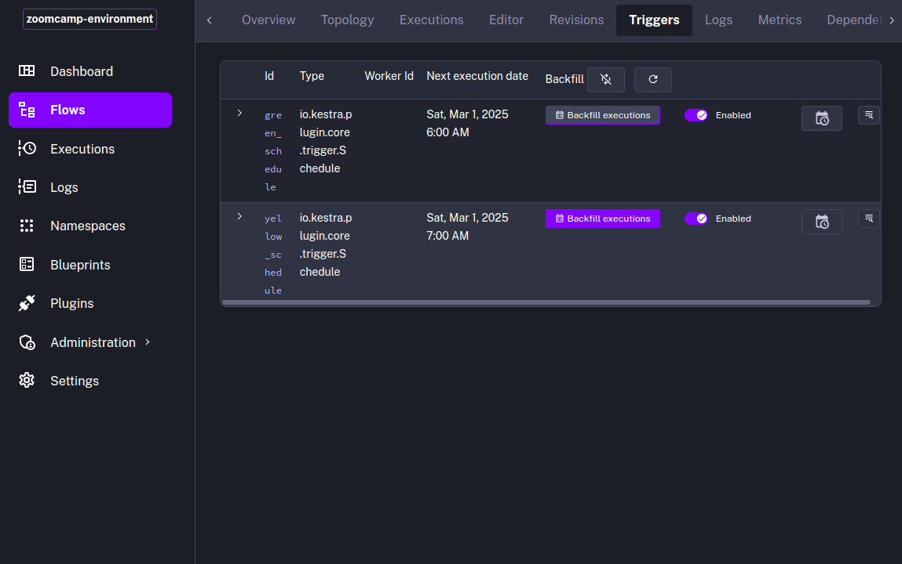
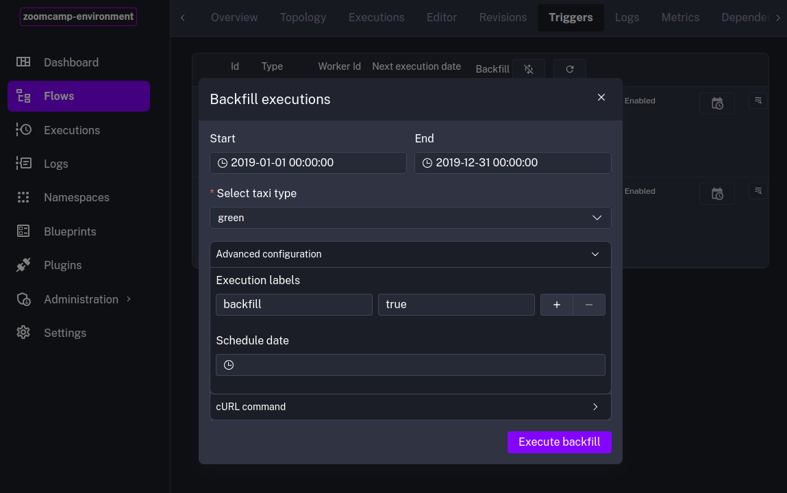

# GCP Taxi Data Ingestion Pipeline

## 📌Overview

This pipeline is designed for scheduled ingestion of NYC taxi trip data (yellow or green) into Google Cloud Platform (GCP).

## 📁 Files used in this notebook
- Kestra **`gcp_taxi_scheduled`** flow [2-2-7-flow.yml](../flows/2-2-7-flow.yml)

## ⏰ Scheduling Data Ingestion

Scheduling ensures that the pipeline runs at the desired times without manual intervention. We use **Cron syntax** to define when each task or pipeline should execute. This is useful for ensuring that data is ingested consistently, typically on a **monthly** basis, to maintain up-to-date datasets.


### Example of Scheduled Trigger in Kestra

The following **Cron expressions** are used to trigger data ingestion for each taxi type.

#### Green Taxi Schedule

This schedule triggers the ingestion process for the **green taxi data** every month.

- Runs on the 1st of every month at 9:00 AM

  ```yaml
  triggers:
    - id: green_schedule
      type: io.kestra.plugin.core.trigger.Schedule
      cron: "0 9 1 * *"
      inputs:
        taxi: green
  ```

#### Yellow Taxi Schedule

This schedule triggers the ingestion process for the **yellow taxi data** every month.

- Runs on the 1st of every month at 10:00 AM

  ```yaml
  triggers:
    - id: yellow_schedule
      type: io.kestra.plugin.core.trigger.Schedule
      cron: "0 10 1 * *"
      inputs:
        taxi: yellow
  ```

## 🛠️ Task Scheduling Configuration

Kestra allows you to define triggers for task execution with **Cron expressions**. The configuration defines when specific tasks should run, including handling backfilling scenarios.

### Scheduling Workflow

1. **Trigger:** A scheduled trigger invokes a pipeline or task based on the defined cron expression.
2. **Execution:** Once triggered, the task is executed according to the task definition (e.g., downloading data, uploading to GCS, or processing in BigQuery).
3. **Backfill Detection:** If the backfill flag is set, the pipeline processes data for past dates instead of the current month.

---

## 🔄 Backfill Strategy

Backfilling refers to the process of running the pipeline for past dates to catch up on data that wasn't ingested at the time of the scheduled run. This is useful when:

1. **A task fails** or encounters an error, causing a missed ingestion.
2. **Missing data** that needs to be manually processed for a specific period.

### Why Backfill?

- **Ensure Complete Data:** If for any reason a scheduled run is skipped (e.g., due to an error or downtime), backfilling will ensure the data is available.
- **Accurate Analytics:** Keeping your BigQuery datasets up to date allows for accurate reports and analyses without gaps in the data.

### Backfill Workflow

The backfill process works by manually triggering the same task or pipeline for a specific past date. For example, if the green taxi data for **January 2025** is missing, you can run a backfill operation to ensure that this data is ingested and available for querying.

#### Manual Backfill Trigger

- To trigger a backfill for a specific month, you can manually specify the date and force the task to run.



- By setting the `backfill: true` flag, you can distinguish between regular scheduled runs and backfill runs, ensuring the system doesn't confuse them.



---

| [HOME](../README.md) | [<< BACK](./2-2-6-notes.md) |
| -------------------- | ----------------------- |
