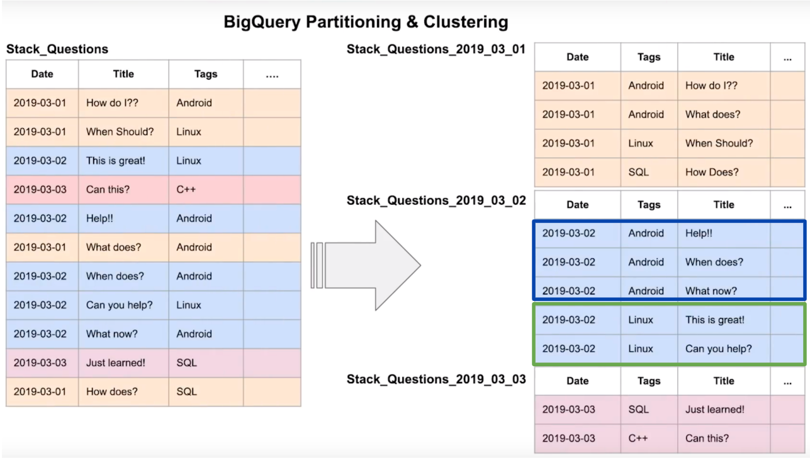

# Data Warehouse & BigQuery Introduction

## 📖 Summary

This introduction provides an overview of **Data Warehouses**, with a focus on **[Google BigQuery](https://cloud.google.com/bigquery)**. It covers essential concepts like:

- OLTP vs OLAP
- What a Data Warehouse is
- BigQuery features and pricing models
- Best practices for optimizing queries

## 🔑 Key Concepts

### 🧳 OLTP vs OLAP

**OLTP (Online Transaction Processing)**
Used for transactional data in backend systems. It's optimized for fast, small operations (e.g., customer-facing systems). The data is **normalized** to optimize for efficiency.

**OLAP (Online Analytical Processing)**
Designed for complex analytical queries and large data volumes, typically used by data scientists and analysts. The data is **denormalized** to optimize query performance and reduce data retrieval time.

| KEY POINTS              | OLTP                                                                                              | OLAP                                                                              |
| ----------------------- | ------------------------------------------------------------------------------------------------- | --------------------------------------------------------------------------------- |
| **Purpose**             | Control and run essential business operations in real time                                        | Plan, solve problems, support decisions, discover hidden insights                 |
| **Data updates**        | Short, fast updates initiated by user                                                             | Data periodically refreshed with scheduled, long-running batch jobs               |
| **Database design**     | Normalized databases for efficiency                                                               | Denormalized databases for analysis                                               |
| **Space requirements**  | Generally small if historical data is archived                                                    | Generally large due to aggregating large datasets                                 |
| **Backup and recovery** | Regular backups required to ensure business continuity and meet legal and governance requirements | Lost data can be reloaded from OLTP database as needed in lieu of regular backups |
| **Productivity**        | Increases productivity of end users                                                               | Increases productivity of business managers, data analysts, and executives        |
| **Data view**           | Lists day-to-day business transactions                                                            | Multi-dimensional view of enterprise data                                         |
| **User examples**       | Customer-facing personnel, clerks, online shoppers                                                | Knowledge workers such as data analysts, business analysts, and executives        |

### 🏢 What is a Data Warehouse?

A **data warehouse** is an OLAP solution that supports **business intelligence (BI)** and **data analytics** by storing large amounts of data. The key characteristics include:

- **Raw Data**: Direct data from operational sources.
- **Metadata**: Information about the structure and organization of the data.
- **Summary Data**: Aggregated data used for easier querying and reporting.

Data warehouses store data from various sources, such as transactional databases, log files, and external feeds, then clean and transform this data for reporting and analytics purposes.

<div align="center">
    
</div>


## 🛠 BigQuery Overview

### 🌐 What is BigQuery?

BigQuery is a **serverless** and **highly scalable** data warehouse provided by Google Cloud. Key features include:

- **No Server Management**: No need for database maintenance or management.
- **Scalable**: From gigabytes to petabytes of data.
- **Separation of Storage and Compute**: Optimize storage costs by paying for only the data stored.

For more details, visit the [Google BigQuery Documentation](https://cloud.google.com/bigquery).

### 💡 BigQuery Features

- **Machine Learning Integration**: Use BigQuery ML to build and deploy machine learning models directly with SQL.
- **Geospatial Queries**: Analyze geographic data using geospatial functions.
- **Business Intelligence**: Easily integrate with BI tools like Google Data Studio, Tableau, etc.

## 💸 BigQuery Pricing Models

BigQuery offers two main pricing options:

### 1. **On-Demand Pricing**

- **Cost**: $6.25 per **TiB** of data processed.
- **Best for**: Low-volume or infrequent queries.

### 2. **Flat-Rate Pricing**

- **Cost**: Based on the number of **slots** you purchase for computing.
- **Best for**: High-volume queries or workloads with frequent, large queries.

> [!IMPORTANT]
>
> Refer to the official [BigQuery Pricing Models](https://cloud.google.com/bigquery/pricing) page for an up-to-date information.

## 🔎 BigQuery Interface

### ✍️ Query Editor

BigQuery’s **query editor** allows you to run SQL queries against datasets directly in the console. This editor supports:

- Writing custom SQL queries.
- Exploring public datasets (e.g., **New York City Bike Stations Data**).
- Viewing and exporting query results.

### 📊 Public Datasets

BigQuery provides **public datasets** you can use for testing and exploration. These datasets cover a wide range of topics, including:

- **Weather data**
- **Census data**
- **Transportation data**

Find public datasets in the [BigQuery Public Datasets page](https://cloud.google.com/bigquery/public-data).

#### 🏙 Query Public Dataset

```sql
-- Query the Citibike station data to get a list of station IDs and names
SELECT station_id, name
FROM bigquery-public-data.new_york_citibike.citibike_stations
LIMIT 100;
```

This query fetches station IDs and names from the **NYC Citibike** public dataset.

## ⚙️ Importing & Querying Data

### 🔄 Importing Data

BigQuery allows you to import data from sources like:

- **Google Cloud Storage**
- **Google Sheets**
- **Local files (CSV, JSON, Avro)**

You can upload the data and then query it using **SQL**. Once queried, results can be exported in formats like **CSV**.

#### 🚖 External Table Creation

```sql
-- Create an external table that references CSV files stored in Google Cloud Storage
CREATE OR REPLACE EXTERNAL TABLE `taxi-rides-ny.nytaxi.external_yellow_tripdata`
OPTIONS (
  format = 'CSV',
  uris = ['gs://nyc-tl-data/trip data/yellow_tripdata_2019-*.csv', 'gs://nyc-tl-data/trip data/yellow_tripdata_2020-*.csv']
);
```

Here, an **external table** is created from CSV files stored in Google Cloud Storage. The external table allows you to query the data without having to load it into BigQuery.

#### 🚖 Check External Data

```sql
-- Check data in the external table (e.g., 10 rows)
SELECT * FROM taxi-rides-ny.nytaxi.external_yellow_tripdata
LIMIT 10;
```

This query fetches the first 10 rows of the **yellow taxi trip data** from the external table.

## 📂 Partitioning in BigQuery

### 🗓️ Partitioned Tables

BigQuery allows you to partition tables by:

- **Date**: Useful for time-series data or logs.
- **String or Integer**: For categorical data like product IDs or regions.

### 📉 Cost Optimization

When querying partitioned tables, only relevant partitions are scanned, reducing the total amount of data processed. This can save **substantial costs**.

### 🛠️ Partitioning Example

```sql
CREATE OR REPLACE TABLE
    `my_partitioned_table`
PARTITION BY
    DATE(`Creation_date`) AS
        SELECT * FROM
            `raw_data`;
```

In this example, data is partitioned by **creation_date**.


#### 📅 Create a Partitioned Table

```sql
-- Create a partitioned table based on the 'tpep_pickup_datetime' field
CREATE OR REPLACE TABLE
    `taxi-rides-ny.nytaxi.yellow_tripdata_partitoned`
PARTITION BY
    DATE(`tpep_pickup_datetime`) AS
        SELECT * FROM
            `taxi-rides-ny.nytaxi.external_yellow_tripdata`;
```

Partitioning helps reduce query costs by only scanning the relevant partitions.

#### 📊 Impact of Partitioning

```sql
-- Query scanning 1.6GB of data (no partitioning)
SELECT DISTINCT
    VendorID
FROM
    `taxi-rides-ny.nytaxi.yellow_tripdata_non_partitoned`
WHERE
    DATE(tpep_pickup_datetime) BETWEEN '2019-06-01' AND '2019-06-30';
```

Without partitioning, BigQuery scans **1.6GB** of data.

```sql
-- Query scanning ~106MB of data (partitioned)
SELECT DISTINCT
    VendorID
FROM
    `taxi-rides-ny.nytaxi.yellow_tripdata_partitoned`
WHERE
    DATE(tpep_pickup_datetime) BETWEEN '2019-06-01' AND '2019-06-30';
```

With partitioning, BigQuery only scans **106MB** of data.

#### 🔍 Query Partitions

```sql
-- Inspect partitions in a partitioned table
SELECT
  table_name,
  partition_id,
  total_rows
FROM
  `nytaxi.INFORMATION_SCHEMA.PARTITIONS`
WHERE
  table_name = 'yellow_tripdata_partitoned'
ORDER BY
  total_rows DESC;
```

This query lists the partitions in the **yellow_tripdata_partitoned** table, showing the number of rows per partition.

## 🔑 Clustering in BigQuery

### 🧑‍💻 What is Clustering?

Clustering organizes the data in each partition by specific columns that are frequently queried, making the queries faster and more efficient. It’s ideal for:

- **Frequently filtered or sorted columns**: Example: `tags`, `region`.

### 🛠️ Clustering Example

```sql
CREATE OR REPLACE TABLE `my_table`
PARTITION BY
    DATE(`Date`)
CLUSTER BY
    `Tags` AS
        SELECT * FROM
            `raw_data`;
```

In this example, data is partitioned by **Date** and clustered by **Tags**.



#### 🚖 Create a Partitioned and Clustered Table for yellow_tripdata.

```sql
-- Create a partitioned and clustered table
CREATE OR REPLACE TABLE
    `taxi-rides-ny.nytaxi.yellow_tripdata_partitoned_clustered`
PARTITION BY
    DATE(`tpep_pickup_datetime`)
CLUSTER BY
    `VendorID` AS
        SELECT * FROM
            `taxi-rides-ny.nytaxi.external_yellow_tripdata`;
```

This creates a table that is both **partitioned** by pickup date and **clustered** by **VendorID**.

#### 📉 Query Scanning Comparison (Partitioned vs. Clustered)

```sql
-- Query scanning 1.1GB of data
SELECT
  COUNT(*) AS trips
FROM
  `taxi-rides-ny.nytaxi.yellow_tripdata_partitoned`
WHERE
  DATE(tpep_pickup_datetime) BETWEEN '2019-06-01' AND '2020-12-31'
  AND VendorID = 1;
```

This query scans **1.1GB** of data.

```sql
-- Query scanning 864.5MB of data (with clustering)
SELECT
    COUNT(*) AS trips
FROM
    `taxi-rides-ny.nytaxi.yellow_tripdata_partitoned_clustered`
WHERE
    DATE(tpep_pickup_datetime) BETWEEN '2019-06-01' AND '2020-12-31'
    AND VendorID = 1;
```

The clustered table reduces the data scanned to **864.5MB**, improving performance and reducing costs.

## ⚡ Best Practices

### 🛠 Optimize Your Queries

- **Use partitioning** when filtering on date or other common fields.
- **Use clustering** to optimize query performance when filtering on specific fields (e.g., `region`).
- **Check estimated costs** before running large queries using BigQuery’s cost estimator.

### 📊 Monitor Query Costs

Use BigQuery’s cost tracking tools to monitor and estimate costs before running large queries.

- Use the **Query Validator** to check the potential cost of queries.

## 🔗 Useful Resources

- [BigQuery Documentation](https://cloud.google.com/bigquery/docs)
- [BigQuery Pricing](https://cloud.google.com/bigquery/pricing)
- [Public Datasets in BigQuery](https://cloud.google.com/bigquery/public-data)
