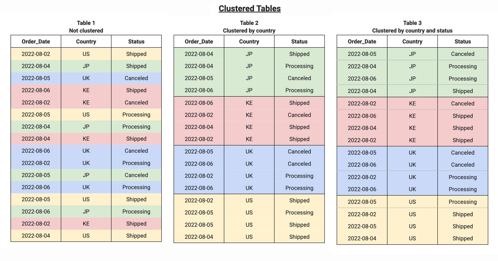
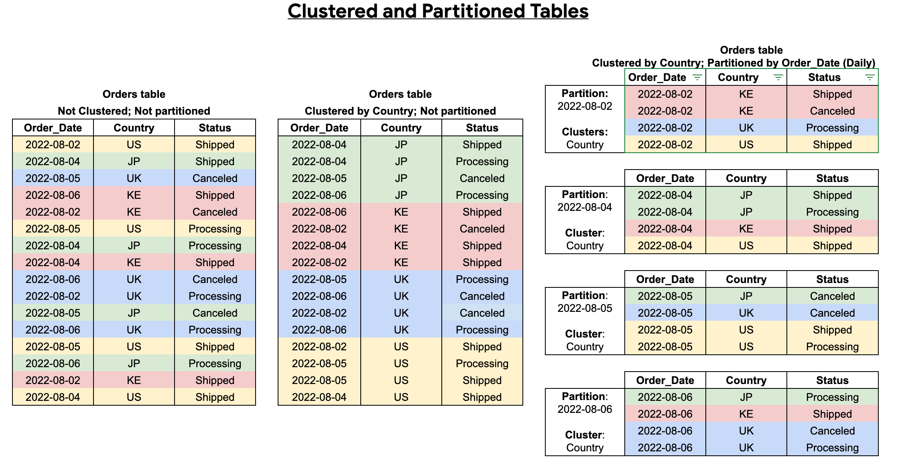

# Partitioning and Clustering in BigQuery

## 📖 Summary

We now dive deeper into **partitioning** and **clustering** in BigQuery, two essential features that optimize query performance and manage large datasets effectively. Understanding when to use each method determines how efficiently data is handled in BigQuery.

- **Partitioning:** Helps manage large datasets by dividing them into smaller, more manageable parts based on specific criteria (e.g., time).
- **Clustering:** Organizes data within partitions for faster queries by specifying **clustering columns**.

## 📅 Partitioning in BigQuery

### What is Partitioning?

Partitioning is the process of dividing large tables into smaller, more manageable segments called **partitions**. This improves query performance by allowing BigQuery to scan only the relevant data.

### Types of Partitioning

BigQuery supports different types of partitioning:

1. **Time-Based Partitioning:**

   - Partition data based on time units (e.g., **day**, **hour**, **month**, **year**). This is ideal for time-series data (e.g., logs).
     | Column value | Partition (monthly) |
     |------------------------|---------------------|
     | DATETIME("2019-01-01") | 201901 |
     | DATETIME("2019-01-15") | 201901 |
     | DATETIME("2019-04-30") | 201904 |

2. **Integer Range Partitioning:**

   - Use when partitioning based on an integer range, although this is less common than time-based partitioning.

     | Argument    | Value       |
     | ----------- | ----------- |
     | Column name | customer_id |
     | Start       | 0           |
     | End         | 100         |
     | Interval    | 10          |

   - The table is partitioned on the `customer_id` column into ranges of interval 10. The values 0 to 9 go into one partition, values 10 to 19 go into the next partition, etc., up to 99. Values outside this range go into a partition named `__UNPARTITIONED__`. Any rows where `customer_id` is `NULL` go into a partition named `__NULL__`

#### Best Use Cases for Partitioning

- **Time-Series Data** like event logs, sensor data, etc.
- **Growing Datasets** where new data is added frequently over time.

### Benefits of Partitioning

- **Improved Query Performance:** BigQuery can skip irrelevant partitions, reducing the data scanned during queries.
- **Cost Management:** By querying smaller partitions, BigQuery costs can be lowered.

## 🔍 Clustering in BigQuery

### What is Clustering?

Clustering allows data within **partitions** to be organized by specifying **clustering columns**. BigQuery then physically organizes the data based on the values of these columns, improving query performance when filtering or aggregating data based on them.

#### How Clustering Works:

- **Sorted Data:** Data within a partition is sorted based on the clustering columns.
- **Efficiency:** Clustering speeds up queries that involve filtering or aggregating on clustered columns.

#### Best Use Cases for Clustering

- When data is frequently **filtered** or **aggregated** on specific columns (e.g., customer ID, product type).
- When the data has **high cardinality** in clustering columns.

### Benefits of Clustering:

- **Query Performance:** Especially beneficial for queries filtering or aggregating on clustered columns.
- **Reduced Scan Size:** By narrowing down data blocks, clustering reduces the data scanned, improving query efficiency.

## 🛠️ Automatically Managed Clustering

### What is Automatic Clustering?

BigQuery automatically performs **auditory clustering** on data as it is inserted into a clustered table. This ensures that data stays in the optimal order without manual intervention, maintaining query performance.

#### Key Features of Automatic Clustering:

- **No User Action Required:** BigQuery manages clustering in the background.
- **No Additional Cost:** The automatic clustering process is free of charge.
- **Partition-Specific Clustering:** For partitioned tables, clustering is handled separately within each partition.

### Benefits of Automatic Clustering:

- **Optimized Data Structure:** Ensures that the data is always in the right order for efficient queries.
- **Hands-Off Maintenance:** Clustering happens automatically, requiring no user involvement.

## ⚖️ Partitioning vs. Clustering: Key Differences

### When to Choose Partitioning:

- Data grows over time and filtering is needed based on **time** (e.g., **logs**, **transactions**).
- **Cost control** for queries is desired by limiting the amount of data scanned.

### When to Choose Clustering:

- **Optimization of queries** that filter or aggregate on **multiple columns** is required.
- The dataset is **large**, and query performance for complex queries needs improvement.

| **Feature**       | **Partitioning**                      | **Clustering**                                          |
| ----------------- | ------------------------------------- | ------------------------------------------------------- |
| **Cost Control**  | Costs are known in advance.           | Cost benefits vary and are less predictable.            |
| **Granularity**   | Single column (e.g., **date**).       | Supports multiple columns for finer granularity.        |
| **Best Use Case** | Ideal for time-series data like logs. | Optimal for data frequently queried on multiple fields. |

## 📊 Which Should Be Used?

### When to Use Partitioning:

- When the dataset is large and grows over time.
- When queries mostly filter or aggregate on **one column** (e.g., date).

### When to Use Clustering:

- When filtering or aggregating on **multiple columns**.
- When partitioning alone does not provide sufficient optimization.

## 🥇 **Combining Clustered and Partitioned Tables**

### What Happens When Partitioning and Clustering Are Combined?

Table **partitioning** can be combined with table **clustering** to achieve more finely grained sorting for further query optimization.

- **Partitioning** segments data into smaller, more manageable parts (e.g., by time).
- **Clustering** organizes the data within those partitions based on specified **clustering columns**.

In this combined approach:

- Data is **partitioned** into segments (such as daily, hourly, or monthly).
- Within each partition, the data is **clustered** based on user-defined columns. This improves query performance because BigQuery scans only the relevant **storage blocks** that match the clustering columns, instead of the entire partition.

### Benefits of Combining Partitioning and Clustering:

- **Fine-Grained Sorting:** Better performance is achieved by combining both techniques. Data within each partition is not only segmented but also ordered within partitions for faster retrieval.
- **Optimized Queries:** When queries filter on both partitioned and clustered columns, this combination provides a highly efficient way to scan the data with minimal overhead.

## 💡 Conclusion

**Partitioning** and **clustering** are powerful techniques in BigQuery that help with both performance optimization and cost management. Deciding between them depends on the dataset and query needs:

- **Partitioning** is ideal for managing large datasets that grow over time and are filtered by a single column.
- **Clustering** is best for improving performance when filtering or aggregating on multiple columns.

**Automatic clustering** can also be used to ensure that BigQuery optimizes the data layout without additional cost or user intervention.

## 🔗 Useful Resources

- BigQuery documentation on [Partitioning](https://cloud.google.com/bigquery/docs/partitioned-tables)
- BigQuery documentation on [Clustering](https://cloud.google.com/bigquery/docs/clustered-tables)

---

| [HOME](../README.md) | [<< BACK](./3-1-1-notes.md) | [NEXT >>](./3-2-1-notes.md) |
| -------------------- | --------------------------- | --------------------------- |
