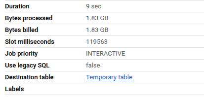
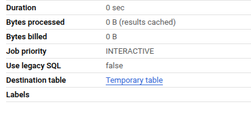
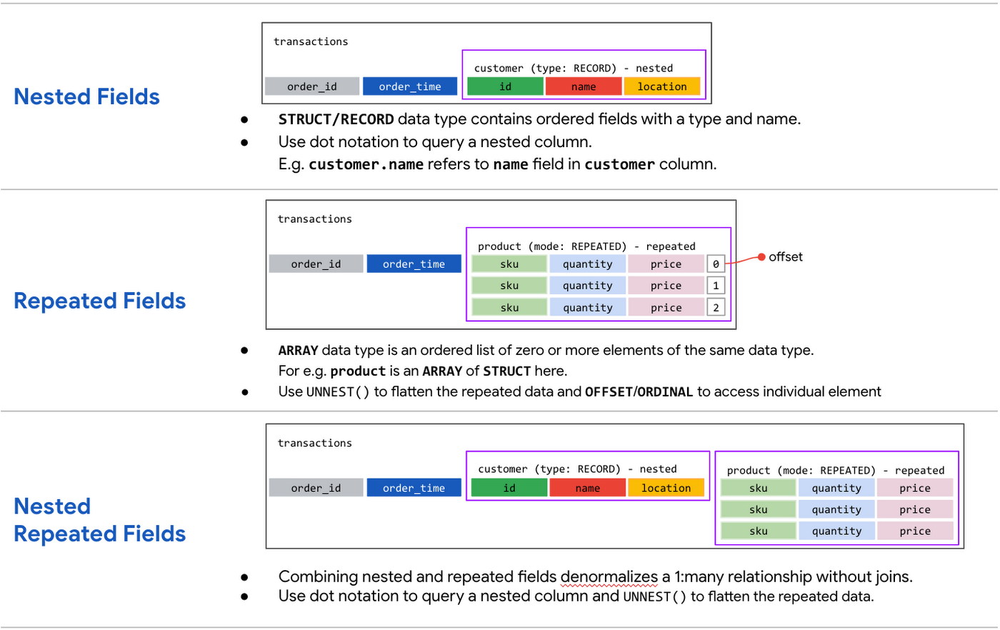

# BigQuery Best Practices

## 📌 Overview

This is a series of best practices presented in the **'know-why'** format, aimed at optimizing BigQuery usage. It focuses on reducing costs and improving query performance. Implementing these practices helps enhance query efficiency, minimize costs, and maximize BigQuery resource utilization.

## 📋 Summary

Following these **BigQuery best practices** will:

- Minimize query costs
- Improve query execution performance
- Create efficient and maintainable queries

## Cost Reduction Practices 💸

### 1. Avoid `SELECT *`

🔹 **Why?**

- Using `SELECT *` retrieves all columns in a table, leading to unnecessary data processing. BigQuery uses **columnar storage**, meaning querying only the specific columns needed is far more efficient.

  ```sql
  -- Bad practice (retrieving unnecessary data)
  SELECT * FROM `my_project.my_dataset.my_table`;

  -- Better practice (only the necessary columns)
  SELECT column1, column2 FROM `my_project.my_dataset.my_table`;
  ```

### 2. Price Queries Before Running Them

🔹 **Why?**

- BigQuery allows the preview of query costs before running them, helping to avoid unexpected charges. Always check the **estimated cost** in the top right corner before executing the query.

### 3. Caution with Streaming Inserts

🔹 **Why?**

- While streaming inserts are useful and necessary for real-time data, they can significantly increase costs. Streaming inserts should be used only when absolutely necessary.

### 4. Materialize Queries for Efficiency

🔹 **Why?**

- When using a **Common Table Expression (CTE)** multiple times, materializing the query result into a temporary table can reduce redundant computations and improve performance.

  - **Not efficient**

    ```sql
    -- Using CTE multiple times (not efficient)
    WITH cte AS (
       SELECT * FROM `my_project.my_dataset.my_table`
    )
    SELECT * FROM cte;
    SELECT * FROM cte;
    ```

  - **Better approach**

    ```sql
    -- Materialize the CTE (better approach)
    CREATE OR REPLACE TABLE `my_project.my_dataset.temp_table` AS
    SELECT * FROM `my_project.my_dataset.my_table`;

    -- Use the temporary table instead of the CTE
    SELECT * FROM `my_project.my_dataset.temp_table`;
    SELECT * FROM `my_project.my_dataset.temp_table`;
    ```

  - Comparing the results

  | Not efficient                     | Better approach                   |
  | --------------------------------- | --------------------------------- |
  |  |  |

## Query Performance Improvement ⚡

### 1. Filter on Partitioned or Clustered Columns

🔹 **Why?**

- If the data is partitioned or clustered, always filter on those columns to reduce the amount of data scanned. This results in faster query execution and lower costs.

### 2. Denormalize Data for Simplicity

🔹 **Why?**

- Denormalizing data can make queries simpler and faster by eliminating the need for complex joins. Use **nested** or **repeated columns** when dealing with complex structures.

  

- Example of denormalized table with nested columns

  ```sql
  CREATE OR REPLACE TABLE `my_project.my_dataset.my_table` AS
  SELECT
      user_id,
      ARRAY<STRUCT<product STRING, amount INT64>>[
        STRUCT('product_1', 10),
        STRUCT('product_2', 20)
      ] AS purchases
  FROM `my_project.my_dataset.purchase_data`;
  ```

  > [!TIP]
  >
  > BigQuery syntax:
  >
  > ```sql
  > ARRAY<STRUCT<...>>[...]
  > ```

### 3. Use External Data Sources Cautiously

🔹 **Why?**

- Reading data from external sources like Google Cloud Storage can incur additional costs. Limiting external data queries can help prevent unnecessary charges.

### 4. Reduce Data Before Using Joins

🔹 **Why?**

- Filtering data before joining tables ensures that only the necessary data is joined, improving performance.

  ```sql
  -- Filter before joining
  SELECT a.column1, b.column2
  FROM `my_project.my_dataset.table_a` AS a
  JOIN `my_project.my_dataset.table_b` AS b
  ON a.id = b.id
  WHERE a.column1 > 100;
  ```

### 5. Optimize Join Patterns

🔹 **Why?**

- Place the largest table first in the join order. This allows BigQuery to distribute the data more efficiently across nodes, improving query performance.

### 6. Use Approximation Aggregation Functions

🔹 **Why?**

- For large datasets, approximate aggregation functions (e.g., `hyperloglog`) are faster and more cost-effective than exact ones.

  ```sql
  -- Approximate count distinct
  SELECT APPROX_COUNT_DISTINCT(column_name)
  FROM `my_project.my_dataset.my_table`;
  ```

### 7. Avoid JavaScript or User-Defined Functions (UDFs)

🔹 **Why?**

- JavaScript and UDFs can degrade query performance. Sticking to built-in SQL functions whenever possible is preferred.

### 8. Place `ORDER BY` at the End

🔹 **Why?**

- Placing the `ORDER BY` clause last ensures that sorting happens after all other operations, improving performance.

  ```sql
  -- Optimized query
  SELECT column1, column2
  FROM `my_project.my_dataset.my_table`
  WHERE column1 > 100
  ORDER BY column1;
  ```

## 📝 Best Practices for Query Design

### 1. Keep Queries Simple

🔹 **Why?**

- Avoid overly complex queries. Simpler queries are easier to optimize and execute faster.

### 2. Optimize Table Access Patterns

🔹 **Why?**

- Avoid over-sharing tables, which can lead to unnecessary data transfers and slow queries.

### 3. Use Clustering and Partitioning

🔹 **Why?**

- Partition tables based on relevant columns and cluster them for better performance when working with large datasets.

## 📚 Additional Resources

- [BigQuery Documentation](https://cloud.google.com/bigquery/docs)

- [BigQuery Optimizing Query Performance](https://cloud.google.com/bigquery/docs/best-practices-performance-overview)

---

| [HOME](../README.md) | [<< BACK](./3-1-2-notes.md) | [NEXT >>](./3-2-2-notes.md) |
| -------------------- | --------------------------- | --------------------------- |
