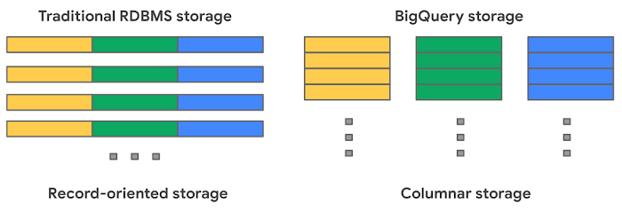
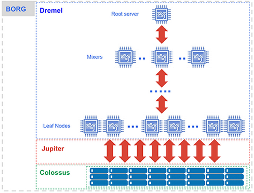

# Internals of BigQuery

> [!IMPORTANT]
>
> Knowing the internals **IS NOT** necessary for effective usage of BigQuery.
>
> Understanding its architecture can significantly improve performance and also reduce costs.

## 📌 Overview

BigQuery’s internal architecture is designed for speed and cost efficiency. By separating storage and compute, utilizing columnar storage, and employing parallel processing, it can handle large datasets efficiently at scale.

The combination of **Colossus**, **Jupiter**, and **Dremel** enables it to process demanding queries with low latency.

- **Colossus Storage** for scalable and cost-effective data storage.
- **Jupiter Network** for fast, low-latency communication.
- **Dremel Engine** for efficient query execution.

## 💾 Storage: Colossus

The storage is powered by **Colossus**, a high-performance columnar storage system designed to enable fast querying of large datasets.

### Key Features of Colossus:

- **Cost-effective storage**: The separation of storage and compute means that costs are incurred independently for each component.
- **Columnar format**: Data is stored in a columnar format, which is ideal for analytical queries that often aggregate data by specific columns.

### What is Columnar Storage?

Columnar storage stores data by columns rather than rows, which significantly improves performance for queries that filter or aggregate data based on specific columns.

### Record-Oriented vs Column-Oriented Storage

BigQuery uses **columnar storage**, which provides better performance for analytical queries compared to **row-based** storage.

- Record-Oriented Storage (Row-Based)

  - Stores data by rows (e.g., CSV format).
  - Most suitable for transactional systems that require entire records.

- Column-Oriented Storage (BigQuery’s Choice)

  - Stores data by columns, which is ideal for analytical queries.
  - Only the relevant columns are loaded into memory, reducing input/output (I/O) costs.

    

## 🌐 Network: Jupiter

The **Jupiter Network** is the high-speed network infrastructure that connects compute and storage components. With a speed of up to **1 terabyte per second**, Jupiter ensures that data can be accessed and processed with minimal latency, even when storage and compute are located on different hardware.

### Benefits of Jupiter Network:

- **Low-latency**: Fast communication between storage and compute reduces query times.
- **Scalability**: The network supports the growing data demands of enterprises, ensuring it remains fast as data volumes increase.

## 🧠 Query Execution: Dremel

The **Dremel** engine is responsible for query execution. It divides queries into smaller sub-queries that can be executed in parallel across multiple nodes, optimizing performance.

### How Dremel Works:

1. **Query division**: A received query is broken down into smaller sub-queries.
2. **Parallel execution**: The sub-queries are distributed across multiple nodes, with each processing a subset of the data.
3. **Aggregation**: After processing, the results are aggregated and returned as a single result.

    

### Key Benefits of Dremel:

- **Parallel processing**: This technique accelerates query execution by distributing workloads across multiple nodes.
- **Scalability**: The system can scale efficiently as data sizes grow, ensuring consistent query performance.

### Benefits of Columnar Storage:

- **Faster aggregation**: Operations such as summing or averaging specific columns are quicker.
- **Efficient query execution**: Only necessary columns are read, minimizing I/O.

### Query Execution Flow in Dremel

Once a query is submitted, Dremel divides it into smaller tasks that can be processed independently across multiple nodes, allowing for parallel execution. Here's the breakdown:

1. **Query reception**: The root server receives the query.
2. **Task division**: The query is split into sub-queries.
3. **Task distribution**: Sub-queries are assigned to leaf nodes.
4. **Data processing**: The leaf nodes retrieve and process the data.
5. **Result aggregation**: The results are sent back to the root server, where they are aggregated and returned as a final result.

This method of query execution significantly reduces query time by leveraging parallel processing. As data sizes increase, the system continues to process efficiently, ensuring high performance.

## 📚 Additional Resources

For additional insights into BigQuery’s internals:

- [BigQuery Admin reference guide](https://cloud.google.com/blog/topics/developers-practitioners/bigquery-admin-reference-guide-storage)

- [BigQuery under the hood](https://cloud.google.com/blog/products/bigquery/bigquery-under-the-hood)
