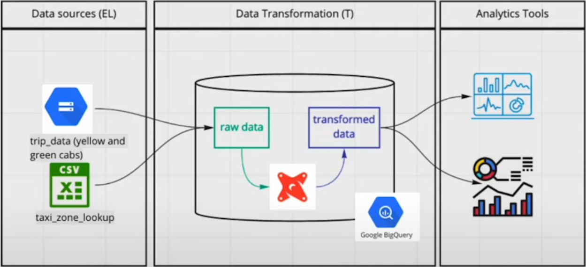

# What is dbt?

## 📌 Overview

Data Build Tool - dbt is a transformation workflow that enables the deployment of analytical code using SQL or Python. It facilitates the transformation of raw data from various sources into structured datasets for business intelligence, reporting, and machine learning workflows.

## 📖 Summary

- **dbt** is a **powerful** transformation tool for analytical workflows.
- Introduces **software engineering** best practices to data transformations.
- Supports **open-source (dbt Core)** and **cloud-based (dbt Cloud)** deployments.
- Provides **flexibility** for different **data warehouse setups**.

## 🛠 Prerequisites

- A data warehouse such as **BigQuery**, **Snowflake**, **Databricks**, or similar
- Basic knowledge of **SQL** and **data modeling**
- Familiarity with **version control systems** (e.g., Git) is beneficial

## 🔑 Key Concepts

### Data Transformation

- dbt processes raw data from multiple sources, including backend systems, third-party providers, and front-end applications.
- Transformed data is stored in a **data warehouse** and made accessible for **business intelligence tools** or other applications.

### Software Engineering Best Practices

- Introduces **modularity**, **version control**, and **CI/CD principles**.
- Encourages the **"Don't Repeat Yourself" (DRY) approach** for maintainable analytics code.
- Allows development in **sandbox environments** before deploying to production.

### dbt Workflow

1. **Development**: Write SQL or Python scripts in an isolated environment.
2. **Testing & Documentation**: Validate transformations and document models.
3. **Deployment**: Run transformations in production using CI/CD pipelines.

## ⚙️ Execution and Compilation

```sql
SELECT * FROM raw_data
WHERE condition = 'true';
```

- dbt compiles SQL or Python scripts into executable queries for the **data warehouse**.
- Automates the generation of **DDL (Data Definition Language)** and **DML (Data Manipulation Language)** statements.
- Stores transformed data as **tables or views** in the data warehouse.

## 🏗 Using dbt

### dbt Core

- **Open-source** and **free to use**.
- Installed locally via the **terminal**.
- Provides a **command-line interface (CLI)** to manage dbt projects.

### dbt Cloud

- A **SaaS platform** that runs dbt Core.
- Includes a **web-based IDE** for development.
- Supports **orchestration, logging, and hosted documentation**.
- Provides **APIs for metadata retrieval and administration**.

## 🔄 Deployment Approaches

### BigQuery with dbt Cloud

- Uses a **free dbt Cloud developer plan**.
- No local installation required.
- Suitable for **managed workflows** and seamless integration with **BigQuery**.

### PostgreSQL with dbt Core

- Runs dbt **locally** using a preferred **IDE** (e.g., VS Code).
- Requires **manual setup** for orchestration and deployment.
- Provides **flexibility** for self-hosted environments.

## 🔄 Project Workflow

1. Load **raw data** into a **data warehouse**.
2. Use **dbt** to **transform and model** the data.
3. Enhance datasets with **additional data sources**.
4. Create **dashboards** for visualization and reporting.



## 📚 Additional Resources

- [dbt Documentation](https://docs.getdbt.com/)
