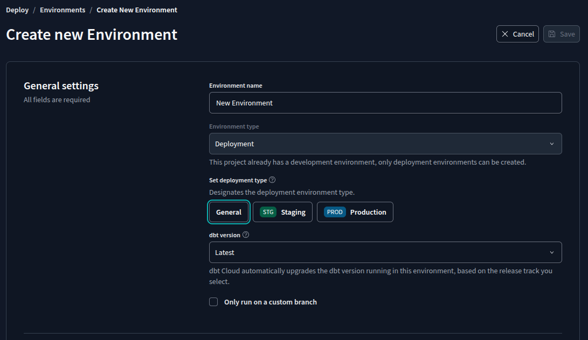

# Deployment Using dbt Cloud

## 📌 Overview

Deploying a dbt project to production ensures that data transformations run reliably and consistently. This section covers how to set up a deployment workflow using dbt Cloud, including environment configuration, job scheduling, and CI/CD integration.

## 📖 Summary

This section covers:

- Setting up a production environment in dbt Cloud
- Scheduling and automating dbt runs
- Running dbt jobs via API triggers
- Monitoring deployments and reviewing logs
- Implementing CI/CD with dbt Cloud

## 🔑 Key Concepts

### Deployment Workflow

- **Development Branching**: Code is developed in separate branches before being merged into the main branch.
- **Pull Requests**: Changes are reviewed before merging into production.
- **Main Branch Execution**: Production runs execute transformations from the main branch.

### Environment Configuration

- **Development and Production Environments**: dbt Cloud allows separate environments for development and production.
- **Permissions Management**: Different users may have different read/write permissions in production.
- **Schema and Dataset Segmentation**: Production data is typically stored in a dedicated schema or dataset.



### Job Scheduling

- dbt jobs can be scheduled to run at predefined intervals (e.g., hourly, daily, weekly).
- Schedules can exclude non-operational periods (e.g., weekends).
- Configurable settings include:
  - Timeout duration
  - Parallel execution threads
  - Dependency resolution

1. Creating a deployment job:
    

2. Creating a schedule-based trigger:
    

### Running dbt Jobs

- **Manual Execution**: Jobs can be triggered on demand.
- **API-Based Execution**: dbt Cloud provides an API to trigger runs programmatically.
  - API eg:

    ```bash
    POST https://cloud.getdbt.com/api/v2/accounts/245504/jobs/811543/run/

    Headers
    { "Authorization": "Token <your-api-key>" }

    Body
    {
    "cause": "Triggered via API",
    }
    ```

- **Integration with Orchestration Tools**: Tools like [Airflow](https://airflow.apache.org/), [Prefect](https://www.prefect.io/), [Mage](https://mage.ai/), [kestra](https://www.kestra.io) can be used to trigger dbt jobs.

### Monitoring and Logs

- **Commit Tracking**: Each run links to a specific commit in the repository.
- **Execution Logs**: dbt Cloud provides detailed logs for each job step.
- **Artifact Storage**: Metadata and logs are available for further analysis.

### Continuous Integration and Deployment (CI/CD)

- **CI Checks**: Runs automated tests on pull requests before merging changes.
- **PR-based Schemas**: Temporary schemas are created for PR testing and removed after merging.
- **Automated Tests**: dbt Cloud can enforce tests to ensure models are documented and valid.
- **Rollback Prevention**: Automated testing minimizes the risk of breaking production data.

1. Creating a CI job:

    

2. Creating a PR-based trigger:

    

3. Default Execution Commands:

    

## 🚀 Execution Flow

1. **Develop and test changes** in a feature branch.
2. **Open a pull request** for code review.
3. **Run CI checks** to validate changes.
4. **Merge approved changes** into the main branch.
5. **Schedule or trigger dbt runs** in production.
6. **Monitor job execution and logs** for issues.
7. **Expose documentation** for team collaboration.

## 📚 Additional Resources

- [dbt Cloud Documentation](https://docs.getdbt.com/docs/dbt-cloud)
- [dbt Deployment](https://docs.getdbt.com/docs/deploy/deployments)
- [dbt API Reference](https://docs.getdbt.com/dbt-cloud/api-v2#/)
- [Best Practices for dbt](https://docs.getdbt.com/docs/guides/best-practices)

---

| [HOME](../README.md) | [<< BACK](./4-3-2-notes.md) |
| -------------------- | --------------------------- |
